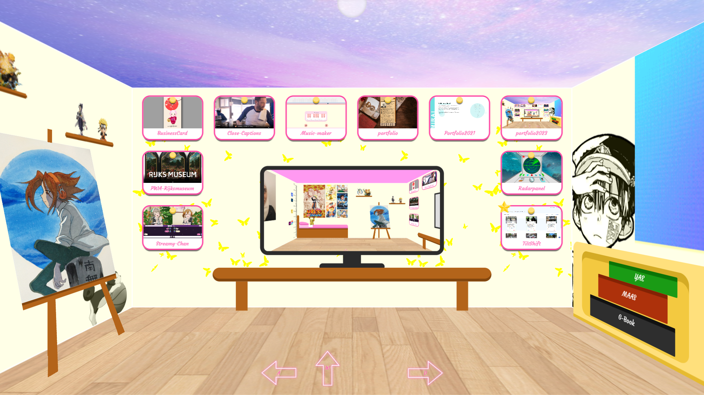
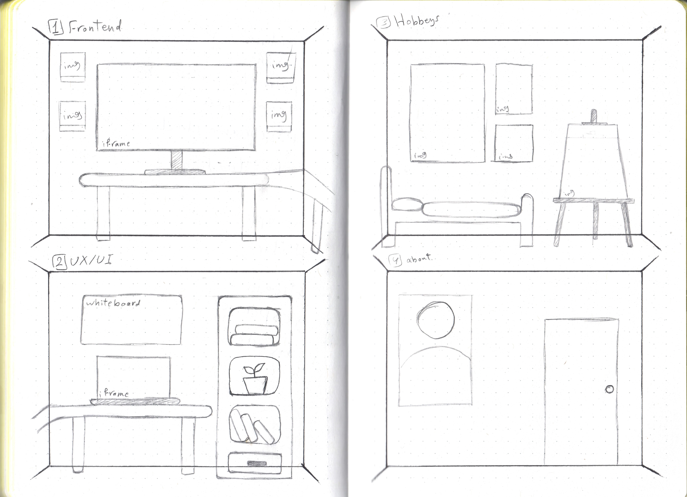
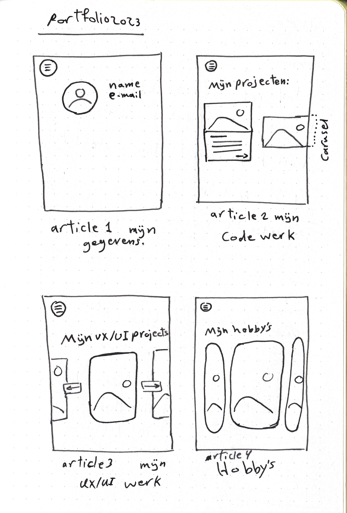
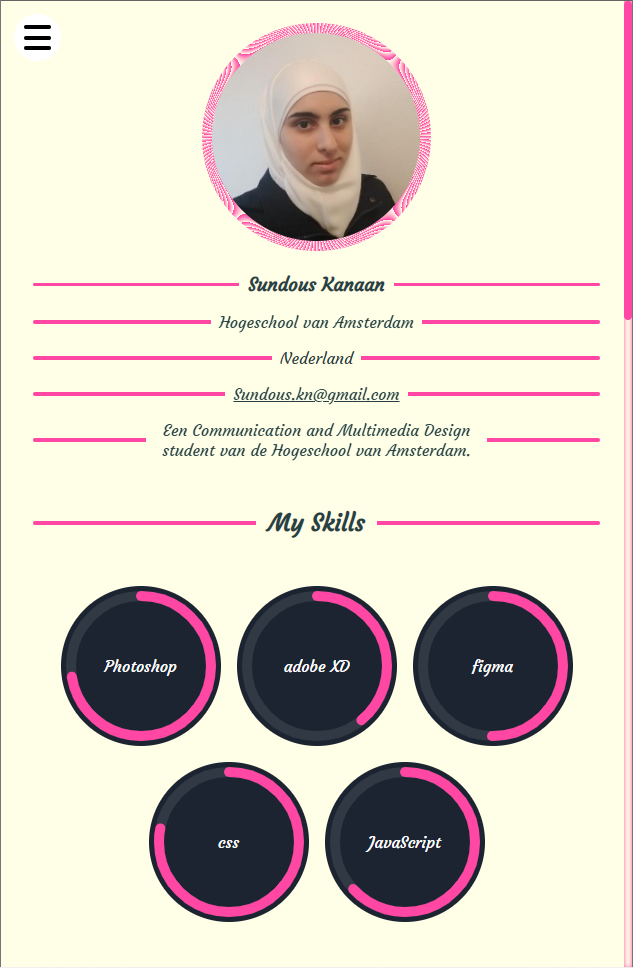
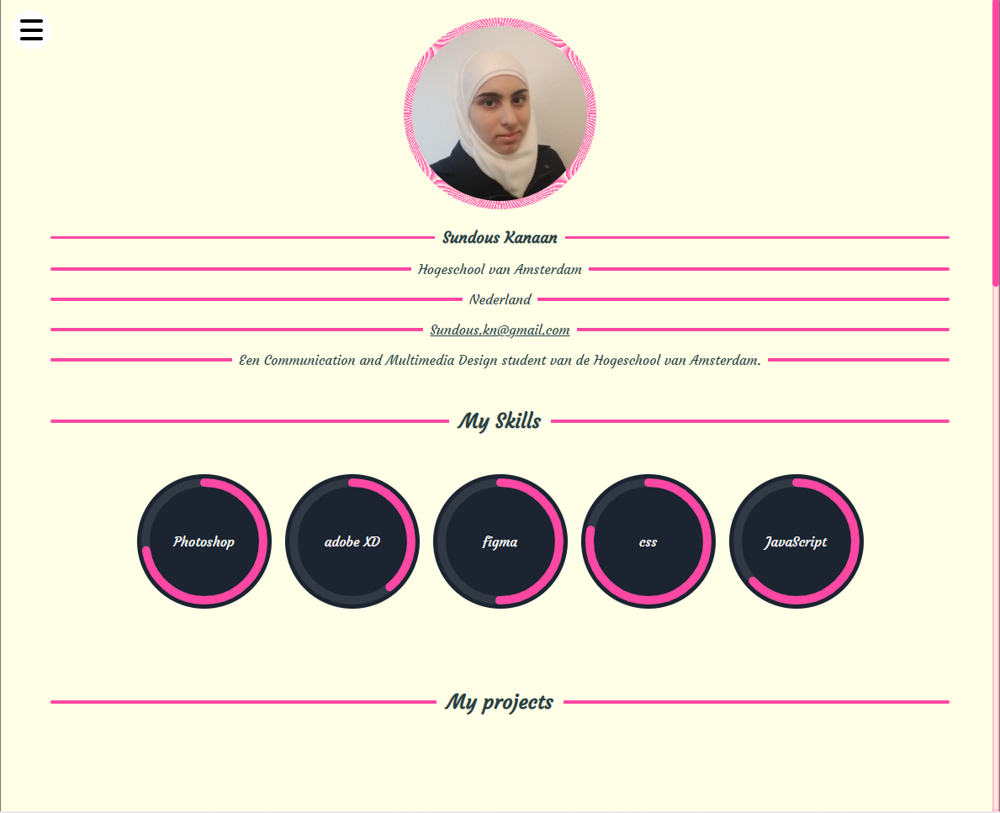
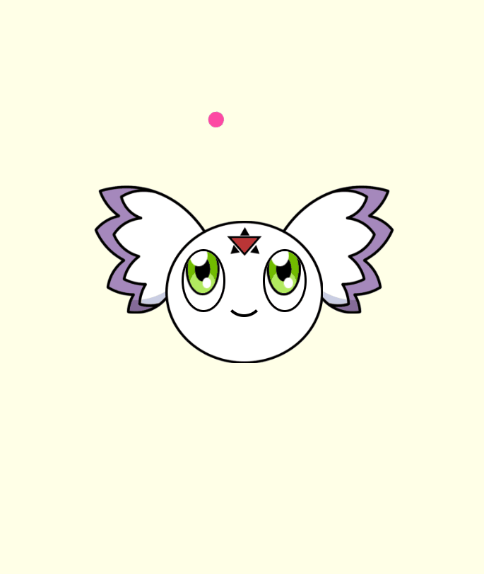
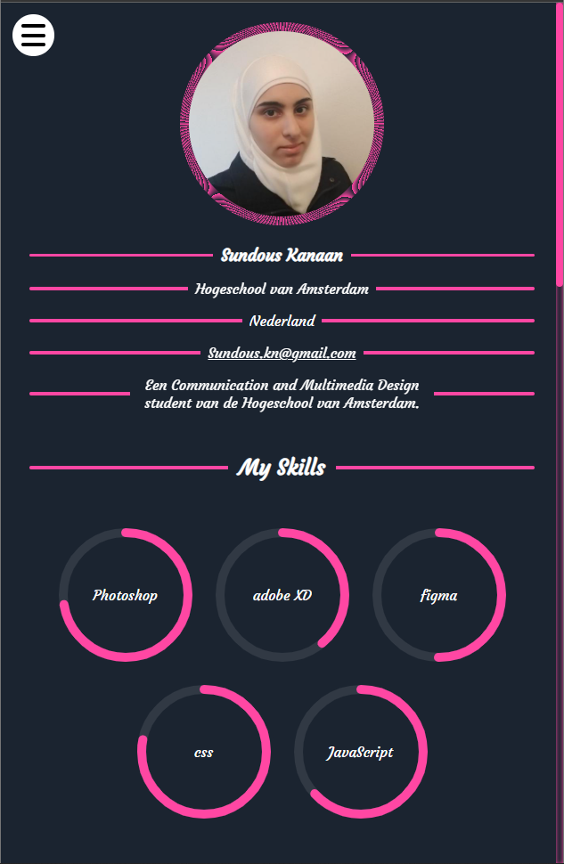
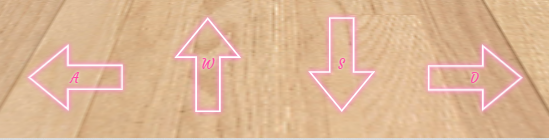
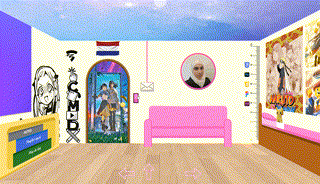
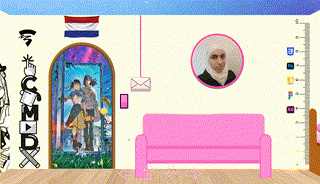

# Portofolio 2023

In my search for an internship for the upcoming academic year, I'm building a new portfolio. This time, I've created a virtual room that truly represents me. Though my actual room is small, I've imagined it on a larger scale. This virtual space showcases my style and serves as a digital portfolio to highlight my skills and best work from my studies. Come along as I bring this expanded room to life in code.

---
# 👁️ Demo Link!

Advise: open it please with Chrome.
- [Online demo](https:/sundouskanaan.github.io/portfolio2023/)

# contents 
- [Portofolio 2023](#portofolio-2023)
- [👁️ Demo Link!](#️-demo-link)
- [contents](#contents)
- [Sketches](#sketches)
- [🛠️ Features Combined](#️-features-combined)
- [Cons](#cons)

# Sketches

Prior to diving into coding, I began by sketching out simple designs for the portfolio, envisioning how it would appear on both small and large screen devices. However, as I progressed with the coding process, certain aspects underwent changes. I discovered new and visually appealing ideas to incorporate, leading to adjustments in interaction style, appearance, and overall design. These modifications allowed for a more captivating and visually striking implementation of the portfolio.

 
Sketches foto's

 

# 🛠️ Features Combined

- 

    
Works on screens of different sizes (phone, tablet, desktop) ✅

    
     
    
    

- 

    
Loading state ✅

    I selected the Digimon Calumon because it possesses a special connection to the Internet, assisting other Digimon with their digievolutions. This unique connection made it a fitting choice for the concept of loading. (and he is so cute)
     

    

    

- phone, tablet:
  - 

    
 Works in light and dark mode ✅

    
    
    

  - 

    
 3D interactions ✅

    
    

  - effect for appearing ✅

- desktop:
  
  - 

    
Desktop style is 3D room ✅

    
    

  - 

    
 Possibility to move in the room with buttons and keyboard ✅

    
    

  - 

    
The possibility of approaching and moving away from the wall to a certain extent ✅

    
    

  
  - 

Possibility to move left and right ✅

    
    

  - 

    
Different interactions for each article ✅

    1. Code projects:
        

    2. UX/UI projects:
        

    3.  About me:
        

    4. My hobby's:
        

    

  - 

    
button to adjust the mode (light / dark) ✅

      

    

  - Save room mode in localstorage ✅
  - 

    
Leave the room completely ✅

    
    

# Cons
Due to time constraints, my room currently lacks smooth and clear accessibility. As this is my first experience creating a space in 3d space, I acknowledge that there is room for improvement in future iterations. Rest assured, I am committed to enhancing accessibility in my future works.

