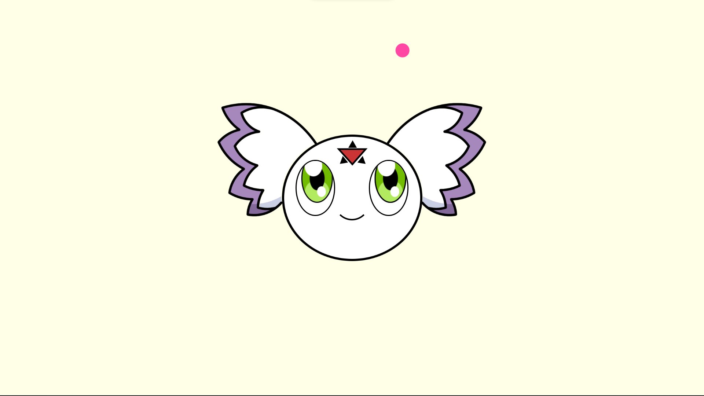

# Portofolio 2023

In my search for an internship for the upcoming academic year, I'm building a new portfolio. This time, I've created a virtual room that truly represents me. Though my actual room is small, I've imagined it on a larger scale. This virtual space showcases my style and serves as a digital portfolio to highlight my skills and best work from my studies. Come along as I bring this expanded room to life in code.

# contents 
- [Portofolio 2023](#portofolio-2023)
- [contents](#contents)
- [🛠️ Features Combined](#️-features-combined)
- [👁️ Demo Link!](#️-demo-link)

# 🛠️ Features Combined

- Works on screens of different sizes (phone, tablet, desktop) ✅
- Loading state ✅
    

    
    

- phone, tablet:
  - Works in light and dark mode ✅
  - 3D interactions ✅
  - effect for appearing ✅
- desktop:
  - Desktop style is 3D room ✅
  - Possibility to move left and right ✅
  - The possibility of approaching and moving away from the wall to a certain extent ✅
  - Different interactions for each element group ✅
  - button to adjust the mode (light / dark) ✅
  - Save room mode in localstorage ✅
  - Leave the room completely ✅

# 👁️ Demo Link!

- [Online demo](https://sundouskanaan.github.io/portfolio2023/)